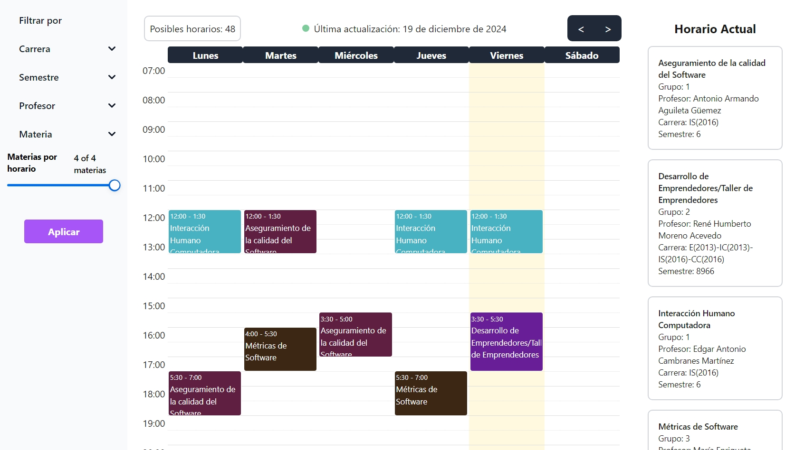

# Kiin



This is a [Next.js](https://nextjs.org) project bootstrapped with [`create-next-app`](https://nextjs.org/docs/app/api-reference/cli/create-next-app).

## Getting Started

### Prerequisites

- Node.js 18+
- npm, yarn, pnpm, or bun

### Installation

1. Clone the repository:

```bash
git clone https://github.com/KiinMx/Kiin.git
cd Kiin
```

2. Install dependencies:

```bash
npm install
# or
yarn install
# or
pnpm install
```

3. **(Optional)** Configure environment variables:
   - Copy `.env.example` to `.env.local`
   - **Note for contributors**: The project will run without environment variables!
   - Only Google Calendar export functionality requires credentials
   - All other features (schedule generation, filters, etc.) work perfectly without them

```bash
cp .env.example .env.local
```

4. Run the development server:

```bash
npm run dev
# or
yarn dev
# or
pnpm dev
# or
bun dev
```

Open [http://localhost:3000](http://localhost:3000) with your browser to see the result.

### Development Mode

When running without Supabase credentials, you'll see a warning message indicating that Google Calendar export is unavailable. This is expected and won't affect any other functionality.

## Contributing

We welcome contributions! The project is designed to work out-of-the-box for contributors:

- ✅ All core features work without credentials
- ⚠️ Only Google Calendar export requires Supabase configuration
- 📝 Fork, make changes, and submit a PR

If you need access to Google Calendar integration for testing, please contact the team.

## Project Structure

```
src/
├── app/              # Next.js app directory
├── domain/           # Domain entities and use cases
├── infrastructure/   # Data sources and repositories
└── utils/            # Utility functions
```

This project uses [`next/font`](https://nextjs.org/docs/app/building-your-application/optimizing/fonts) to automatically optimize and load [Geist](https://vercel.com/font), a new font family for Vercel.

## Learn More

To learn more about Next.js, take a look at the following resources:

- [Next.js Documentation](https://nextjs.org/docs) - learn about Next.js features and API.
- [Learn Next.js](https://nextjs.org/learn) - an interactive Next.js tutorial.

You can check out [the Next.js GitHub repository](https://github.com/vercel/next.js) - your feedback and contributions are welcome!

## Deploy on Vercel

The easiest way to deploy your Next.js app is to use the [Vercel Platform](https://vercel.com/new?utm_medium=default-template&filter=next.js&utm_source=create-next-app&utm_campaign=create-next-app-readme) from the creators of Next.js.

Check out our [Next.js deployment documentation](https://nextjs.org/docs/app/building-your-application/deploying) for more details.
