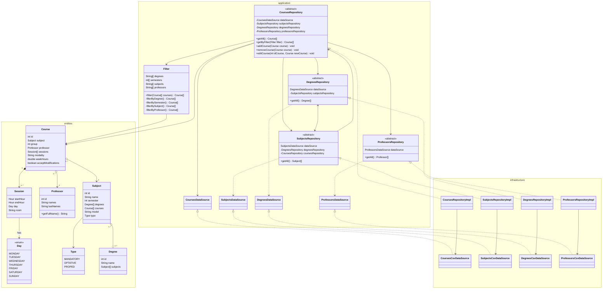

```mermaid
classDiagram 

namespace entities{
    class Day
    class Type
    class Session
    class Professor
    class Degree
    class Subject
    class Course
}

namespace application{
    class Filter
    class CoursesRepository
    class SubjectsRepository
    class DegreesRepository
    class ProfessorsRepository
    class CoursesDataSource
    class SubjectsDataSource
    class DegreesDataSource
    class ProfessorsDataSource
}

class Day{
<<enum>>
    MONDAY
    TUESDAY
    WEDNESDAY
    THURSDAY
    FRIDAY
    SATURDAY
    SUNDAY
}

class Type{
    MANDATORY
    OPTATIVE
    PROPED
}

Session --> Day : has
class Session{
    Hour startHour
    Hour endHour
    Day day
    String room
}

class Professor{
    int id
    String names
    String lastNames
    +getFullName() String
}

class Degree{
    int id
    String name
    Subject[] subjects
}

Subject "1..*" o--o "1..*" Degree
Subject --> Type
class Subject{
    int id
    String name
    int semester
    %% la misma materia puede ser cursada por varias carreras
    Degree[] degrees
    Course[] courses
    String model
    Type type
}

Course "1..*" o--> "1" Subject
Course "1..*" o--> "1" Professor
Course "1" *--> "1..*" Session
class Course{
    int id
    Subject subject
    int group
    Professor professor
    Session[] sessions
    String modality
    double weekHours
    boolean acceptModifications
}

Filter --> Course
class Filter{
    String[] degrees
    int[] semesters
    String[] subjects
    String[] professors

    +filter(Course[] courses) Course[]

    -filterByDegree() Course[]
    -filterBySemester() Course[]
    -filterBySubject() Course[]
    -filterByProfessor() Course[]
}

CoursesRepository --> CoursesDataSource
CoursesRepository --> Filter
CoursesRepository --> Course
CoursesRepository --> SubjectsRepository
CoursesRepository --> ProfessorsRepository
CoursesRepository --> DegreesRepository
class CoursesRepository{
    <<abstract>>
    -CoursesDataSource dataSource
    -SubjectsRepository subjectsRepository
    -DegreesRepository degreesRepository
    -ProfessorsRepository professorsRepository

    +getAll() Course[]
    +getByFilter(Filter filter) Course[]
    +addCourse(Course course) void
    +removeCourse(Course course) void
    +editCourse(int idCourse, Course newCourse) void
}

SubjectsRepository ..> SubjectsDataSource
SubjectsRepository --> CoursesRepository
class SubjectsRepository{
    <<abstract>>
    SubjectsDataSource dataSource
    -DegreesRepository degreesRepository
    -CoursesRepository coursesRepository
    +getAll() Subject[]
}

DegreesRepository ..> DegreesDataSource
DegreesRepository <--> SubjectsRepository
class DegreesRepository{
    <<abstract>>
    DegreesDataSource dataSource
    -SubjectsRepository subjectsRepository
    +getAll() Degree[]
}

ProfessorsRepository ..> ProfessorsDataSource
class ProfessorsRepository{
    <<abstract>>
    ProfessorsDataSource dataSource
    +getAll() Professor[]
}

namespace infrastructure{
    class CoursesRepositoryImpl
    class SubjectsRepositoryImpl
    class DegreesRepositoryImpl
    class ProfessorsRepositoryImpl
    class CoursesCsvDataSource
    class SubjectsCsvDataSource
    class DegreesCsvDataSource
    class ProfessorsCsvDataSource
}

CoursesRepository <|.. CoursesRepositoryImpl
SubjectsRepository <|.. SubjectsRepositoryImpl
DegreesRepository <|.. DegreesRepositoryImpl
ProfessorsRepository <|.. ProfessorsRepositoryImpl

CoursesDataSource <|.. CoursesCsvDataSource
SubjectsDataSource <|.. SubjectsCsvDataSource
DegreesDataSource <|.. DegreesCsvDataSource
ProfessorsDataSource <|.. ProfessorsCsvDataSource

CoursesRepositoryImpl --> CoursesCsvDataSource
SubjectsRepositoryImpl --> SubjectsCsvDataSource
DegreesRepositoryImpl --> DegreesCsvDataSource
ProfessorsRepositoryImpl --> ProfessorsCsvDataSource


```