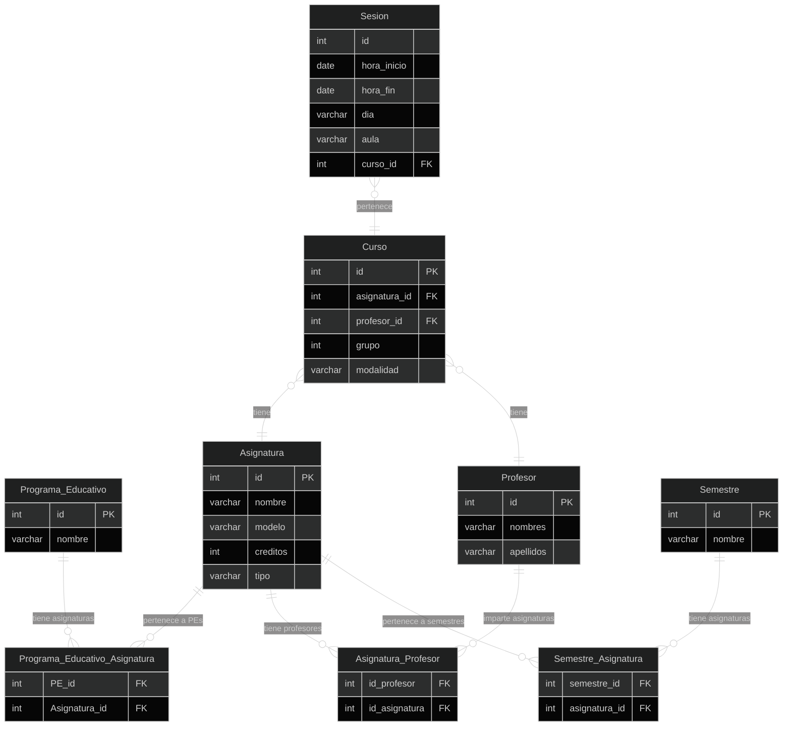

```mermaid

---
config:
  theme: dark
---
erDiagram
    Programa_Educativo ||--o{ Programa_Educativo_Asignatura : "tiene asignaturas"
    Asignatura ||--o{ Programa_Educativo_Asignatura : "pertenece a PEs"

    Asignatura ||--o{ Asignatura_Profesor : "tiene profesores"
    Profesor ||--o{ Asignatura_Profesor : "imparte asignaturas"

    Semestre ||--o{ Semestre_Asignatura : "tiene asignaturas"
    Asignatura ||--o{ Semestre_Asignatura : "pertenece a semestres"

    Sesion }o--|| Curso : pertenece

    Curso }o--|| Asignatura : tiene
    Curso }o--|| Profesor : tiene

    Sesion{
      int id
      date hora_inicio
      date hora_fin
      varchar dia
      varchar aula
      int curso_id FK
    }

    Curso{
      int id PK
      int asignatura_id FK
      int profesor_id FK
      int grupo
      varchar modalidad
    }

    Semestre_Asignatura{
      int semestre_id FK
      int asignatura_id FK
    }


    Profesor{
        int id PK
        varchar nombres
        varchar apellidos    
    }
    Programa_Educativo{
        int id PK
        varchar nombre
    }
    Asignatura{
        int id PK
        varchar nombre
        varchar modelo
        int creditos
        varchar tipo        
    }
    Semestre{
        int id PK
        varchar nombre
    }
    Asignatura_Profesor{
    int id_profesor FK
    int id_asignatura FK
    }
    Programa_Educativo_Asignatura{
    int PE_id FK
    int Asignatura_id FK
    }

    


```
